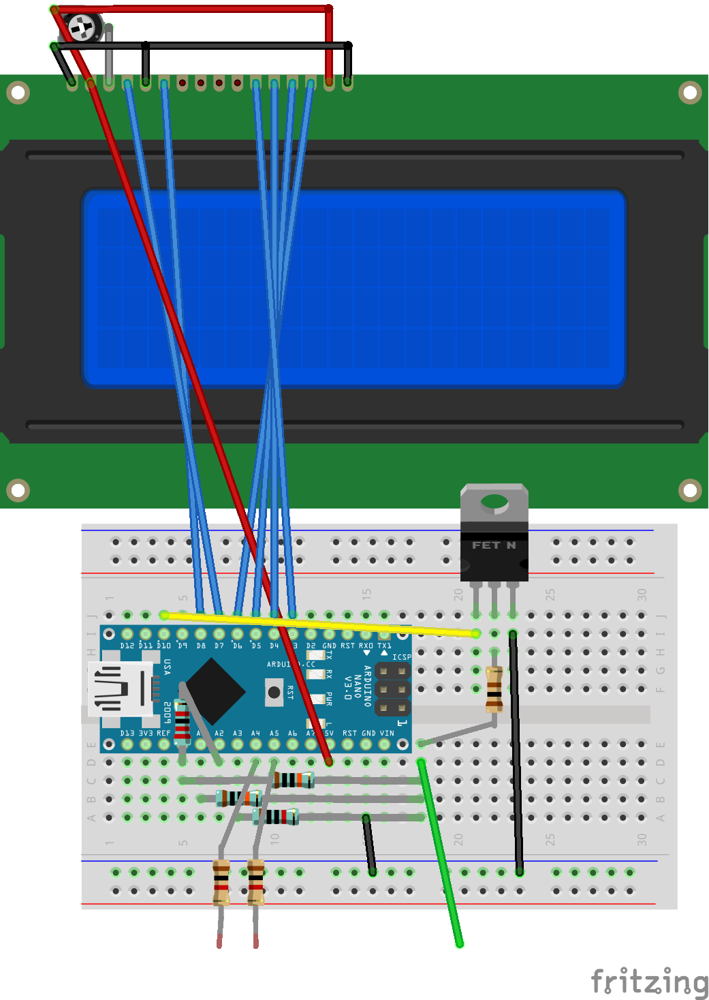
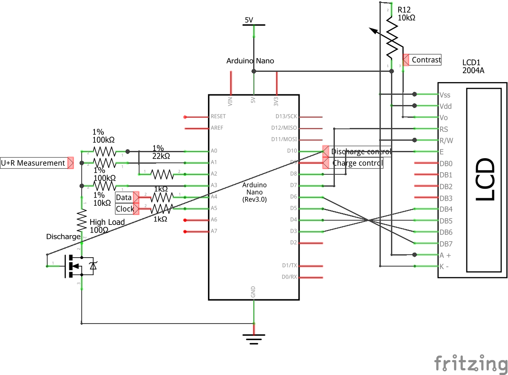

<div align = center>

# [SMB](https://github.com/ArminJo/Smart-Battery-Module-Info_For_Arduino) - Smart Battery Module (Laptop Battery Pack) Info
Prints SBM controller info.<br/>
Based on the unmaintained [PackProbe program](https://github.com/PowerCartel/PackProbe) from Power Cartel http://powercartel.com/projects/packprobe/.


[](https://www.gnu.org/licenses/gpl-3.0)
 &nbsp; &nbsp;
[](https://github.com/ArminJo/Smart-Battery-Module-Info_For_Arduino/releases/latest)
 &nbsp; &nbsp;
[](https://github.com/ArminJo/Smart-Battery-Module-Info_For_Arduino/commits/master)
 &nbsp; &nbsp;
[](https://github.com/ArminJo/Smart-Battery-Module-Info_For_Arduino/actions)
 &nbsp; &nbsp;

<br/>
<br/>
[](https://stand-with-ukraine.pp.ua)

</div>

#### If you find this program useful, please give it a star.

<br/>


# Disclaimer
**I do not know how to enter full access mode, clear permanent failure or unlock any controller IC.** Unfortunately according to most datasheets, you need an unlock key.
See also this [article from 2011](https://media.blackhat.com/bh-us-11/Miller/BH_US_11_Miller_Battery_Firmware_Public_WP.pdf).
Extract: *Macbook batteries ship with a default unseal password (0x36720414).  This was found by reverse engineering a Macbook battery update.  On Macbook batteries, the full access mode password is also hardcoded and default (0xffffffff).* 

<br/>

# Compile with the Arduino IDE
Download and extract the repository. In the Arduino IDE open the sketch with File -> Open... and select the SBMInfo folder. 

<br/>

# Identifying the right connection
Valuable information about battery pinout can also be found [here](https://www.laptopu.ro/community/laptop-battery-pinout/) or [here](https://powercartel.com/projects/packprobe/battery-connection/).<br/>
The minimal connector layout is: | GROUND | THERMISTOR (103AT) | CLOCK | DATA | VCC (11 or 14 volt) | (clock and data my be switched).
- The **thermistor** connection has 10 k&ohm; to ground at 25 degree celsius.
- **Clock** und data connectors have the same resistance (around 0.3 to 1 M&ohm;) to ground and are next to each other.
- **VCC** may not be enabled. Sometimes it gets enabled when *Host Present* is connected to ground or clock and data are pulled high to 3.3 or 5 volt.

Some packs (e.g.for IBM-T41 with bq29310) require once an external voltage (e.g. 11 volt) at the VCC connector to initially get alive after full discharge condition.

If you see more connectors, the may be used for:
- A second (adjacent) ground and / or VCC to reduce the connector resistance for the supply current.
- A *Battery Present* signal. This connector is internally connected to ground at the battery pack and NOT connected to ground at the PC.
- A *Host Present* signal. This connector has a pullup at the battery back and is connected to ground at the PC side.
Examples:
| GROUND | BatteryPresent | THERMISTOR ? | CLOCK | DATA | VCC | - seen at HP packs.
 | GROUND | GROUND | Alert ? | HostPresent | BatteryPresent | DATA | CLOCK  | VCC | VCC | - seen at Dell packs.

After startup, the program scans for a connected I2C device.<br/>
In version 4.0 a voltage and resistance measurement by means of 4 additional resistors is integrated **to identify the I2C pins**.
It measures voltage or resistance to ground (if voltage is zero).<br/>
**The I2c pins have around 300 k&ohm; to 1000 k&ohm;**, the thermistor 10 k&ohm; (sometimes up to 40 k&ohm;).

You can try different I2C pin combinations until led stops blinking and `Found I2C device attached at address: 0x0B` is printed.
If you connect clock or data  with the thermistor connector or ground, the scanning stops.<br/>
After connecting, full data is printed.<br/>
Dynamic values like temperature, voltage and current are checked every 3 seconds and printed if changed.

Tested with bq20z70, bq20z451, bq2084, bq80201DBT, bq40z50.

An example schematic for a SBM module can be found in the datasheet of TI bq29311 at page 9.


<br/>

# Support for automatic discharge and charge
The charge control pin (9) is high as long as relative charge is below 95%. It can be used to control a NPN transistor, which collector controls a high side P FET.<br/>
The discharge control pin (10) is high as long as relative charge is above 5% and voltage, if available, is below 3300 mV. It can be used to control a logic level FET directly.<br/>
The switch off values can be changed [here](https://github.com/ArminJo/Smart-Battery-Module-Info_For_Arduino/blob/master/SBMInfo/SBMInfo.ino#L42)

<br/>

# LCD display content
### LCD Display before device connected
1. line: "SBMInfo" | Version |  VCC voltage
2. line: Date of program compilation
3. line: "Scan for device" | Scan counter
4. line: Resistance or Voltage

### LCD Display after device connected
1. line: "SBMInfo" | Version
2. line: Date of program compilation | Manufacturer name
3. line: Manufacturer date (YYYY-MM-DD) | Battery cycle count
4. line: Design voltage | Design capacity

### LCD Display dynamic data
1. line: Voltage | Current (negative for discharging) | optional 'H' for read error (hold)
2. line: Percent of designed full charge capacity | Design capacity -> Full charge capacity
3. line: Percent of relative charge
3. line: Time to empty of full at current current (of line 1)
4. line: Currently available (remaining) capacity

| Dynamic data | Dynamic data while discharging |
|-|-|
|  |  |

<br/>

# Deutsche Documentation
Gibt die Daten des SMB Controllers aus.
Basiert auf https://github.com/PowerCartel/PackProbe von Power Cartel http://powercartel.com/projects/packprobe/. Hier gibt es auch weitere wertvolle Informationen.

## Finden der Anschl&uuml;sse.
In der Version 4.0 ist eine Spannungs und Widerstandsmessung mittels 4 Widerst&auml;nden integriert, um die I2C Pins zu identifizieren.
Die Clock und Data Eing&auml;nge waren bei meinen Packs die Anschl&uuml;sse mit einem Widerstand von ca. 300 k bis 1 M&ohm; nach Masse.
Nach dem Booten sucht das Programm nach einem angeschlossenen I2C Device.
Man kann also alle m&ouml;glichen Pinkombinationen von Clock und Data am Battery Pack ausprobieren.
Bei der Richtigen h&ouml;rt das Blinken der Led auf und es kommt sofort die Ausgabe `Found I2C device attached at address: 0x0B` und direkt danach werden die Daten ausgegeben.

Bei den Laptop Battery Packs war Plus und Masse immer au&szlig;en.
Wenn mehr als 5 Kontakte vorhanden waren, waren sie wie folgt belegt:
- Masse und Plus doppelt. z.B. + | + | Thermistor | Data | Clock | - | -
- Ein Enable (nur im Laptop mit Masse verbunden) und eine Signal Anschluss (nur im Battery Pack mit Masse verbunden). z.B. VCC | VCC | CLOCK | DATA | Signal | Enable | THERMISTOR | GROUND | GROUND |

Der Thermo-Sensor Anschluss war uneinheitlich, mal nicht messbar beschaltet, mal 1 M&ohm;, mal 1,6 Volt, mal 10 k&ohm; nach Masse.

Zur Verbindung mit den Kontakten habe ich normales 1,5 qmm Kupferkabel aus der Hausinstallation genommen, dessen eines Ende ich mit einem Hammer etwas plattgeklopft hab. Stecknadeln oder Breadboard Wires gehen auch.

Die Daten werden nur einmalig nach dem Reset ausgegeben, nur die ver&auml;nderlichen Werte wie Spannung / Strom / Temperatur / Ladung werden alle 3 Sekunden auf Ver&auml;nderungen gecheckt.

Tested with bq20z70, bq20z451, bq2084, bq80201DBT, bq40z50.

Einen Schaltplan zu den Batterie Modulen gibt es im Datenblatt zum TI bq29311 auf Seite 9.

<br/>

# Sample output:
Sample outputs can be found in folder [extras](https://github.com/ArminJo/Smart-Battery-Module-Info_For_Arduino/tree/master/extras).

```
START ../src/SBMInfo.cpp
Version 4.3 from Nov 23 2023
Configured to set charge control pin 9 to low above 95 %
Configured to stop discharge control pin 10 to low below 5 % or 3300 mV
Found attached I2C device at 0xB

Battery mode                        0x6081 | 0b110000010000001
                                    - Internal Charge Controller Supported
                                    - Battery OK
                                    - Disable AlarmWarning broadcast to Host and Smart Battery Charger
                                    - Disable broadcasts of ChargingVoltage and ChargingCurrent to Smart Battery Charger

Manufacturer Name                   DP-SDI51
Chemistry                           LION
Manufacturer Data                   0x6 7D B B1 67 14 96 D 0 C8 0 A9 2A 
Device Name                         DAVOS
Serial number                       55982 | 0xDAAE
Manufacture date (YYYY-MM-DD)       2008-5-25
Design voltage                      10.800 V
Design capacity                     5100 mAh
Charging current                    3570 mA
Charging voltage                    12.600 V
SBM protocol (Version / Revision)   1.1 with optional PEC support / 1
Cycle count                         277

Max error of charge calculation     100%
Remaining time alarm                10 min
Remaining capacity alarm            510 mAh

*** MANUFACTURER INFO ***
Device Type                         0 | 0x0

*** RATE TEST INFO ***
Setting AT rate to                  100 mA
TimeToFull at rate                  Battery not being (dis)charged - received 0xFFFF
Setting AT rate to                  -100 mA
TimeToEmpty at rate                 21 h 28 min
Can be delivered for 10 seconds at rate  1 | 0x1

*** DYNAMIC INFO ***
Relative charge                     51%
Absolute charge                     42%
Full charge capacity                4215 mAh = 82%
Remaining capacity                  2148 mAh
Voltage                             11.467 V
Current                             0 mA
Average current of last minute      0 mA
Temperature                         21.55 C
Minutes remaining until empty       Battery not being (dis)charged - received 0xFFFF
Average minutes remaining until empty  Battery not being (dis)charged - received 0xFFFF
Minutes remaining for full charge   Battery not being (dis)charged - received 0xFFFF
Battery status                      0xC0 | 0b11000000
                                    80 Initialized
                                    40 Discharging

Pack config and status              0x8230 | 0b1000001000110000
                                    - Pack not inserted
                                    - Voltage > EDV2
                                    - Pack sealed
                                    - Discharge is qualified for capacity learning


*** DYNAMIC NON STANDARD INFO ***
Cell 1 Voltage                      3.826 V
Cell 2 Voltage                      3.823 V
Cell 3 Voltage                      3.819 V
Cell 4 Voltage                      0x0

*** CHANGED VALUES ***

--- Next values are from another Pack! I connected 22 ohm Resistor -> 699 mA discharging

Voltage                             15.788 V
Average current of last minute      -187 mA
Average minutes remaining until empty: 15 h 24 min
Cell 4 Voltage:                     3.935 V
Voltage                             15.807 V
Average current of last minute      -120 mA
Average minutes remaining until empty: 24 h 1 min
Cell 4 Voltage:                     3.949 V
Average current of last minute      -77 mA
Average minutes remaining until empty: 37 h 25 min
Voltage                             15.714 V
Current                             -699 mA
Average current of last minute      -178 mA
Minutes remaining until empty       4 h 7 min
Average minutes remaining until empty: 16 h 11 min
```

<br/>

# Fritzing board

# Fritzing schematics


# Revision History
### Version 4.3
- Fixed no voltage measurement bug.
- Improved print and LCD display after I2C reconnection.

### Version 4.2
- Removed compile time warnings.

### Version 4.1.0
- Support for automatic discharge and charge.
- Improved output.

### Version 4.0.0
- Integrated voltage and resistance measurement.
- Major improvements in I2C communication and output.
- Detection of disconnect.
- Improved LCD output.

### Version 3.1.1
- Better prints at scanning.
